# Custom emojis

129 original 128x128 PNGs for LastZ Assistant, drawn by `scripts/make_emojis.py` (edit that and rerun; don't hand-edit the PNGs). Each file name is the emoji name. `_preview.png` is a contact sheet, not an emoji.

Upload them as **application emojis** (Developer Portal > the app > Emojis; up to 2000 per app), then use them in messages as `<:name:id>`.

## Alliance metrics (9)

| Emoji | Name | What it is |
|---|---|---|
| 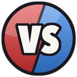 | `vs_points` | Versus Points: red vs blue split badge |
|  | `tech_contribution` | Tech Contribution: gear and research flask |
|  | `hq_level` | HQ Level: fortified headquarters with an up-arrow |
| 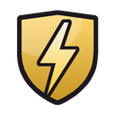 | `power` | Power: gold shield with a lightning bolt |
| 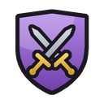 | `arena_power` | Arena Power: crossed swords on a purple shield |
| 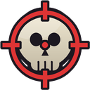 | `kills` | Kills: skull in red crosshairs |
|  | `growth_up` | Week-on-week growth: rising bars |
|  | `growth_down` | Week-on-week drop: falling bars |
|  | `personal_best` | Personal best: gold star with PB |

## Ranks and placings (17)

| Emoji | Name | What it is |
|---|---|---|
| 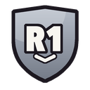 | `rank_r1` | Alliance rank R1 badge |
| 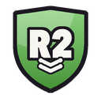 | `rank_r2` | Alliance rank R2 badge |
| 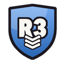 | `rank_r3` | Alliance rank R3 badge |
| 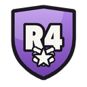 | `rank_r4` | Alliance rank R4 badge |
| 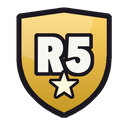 | `rank_r5` | Alliance rank R5 badge |
|  | `place_1` | Leaderboard place 1 medal |
|  | `place_2` | Leaderboard place 2 medal |
| 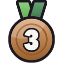 | `place_3` | Leaderboard place 3 medal |
|  | `place_4` | Leaderboard place 4 medal |
|  | `place_5` | Leaderboard place 5 medal |
|  | `place_6` | Leaderboard place 6 medal |
|  | `place_7` | Leaderboard place 7 medal |
| 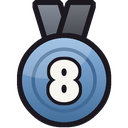 | `place_8` | Leaderboard place 8 medal |
| 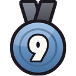 | `place_9` | Leaderboard place 9 medal |
| 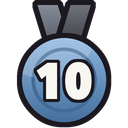 | `place_10` | Leaderboard place 10 medal |
| 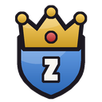 | `leader` | Alliance leader: crown over a shield |
| 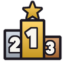 | `leaderboard` | Leaderboard podium 1-2-3 |

## Alliance and VS duel (20)

| Emoji | Name | What it is |
|---|---|---|
| 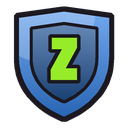 | `alliance` | Alliance shield with a Z crest |
| 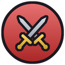 | `attack` | Attack: crossed swords on red |
| 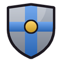 | `defend` | Defend: steel shield with a blue band |
|  | `reinforce` | Reinforce: green shield with a plus |
| 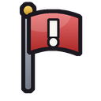 | `rally` | Rally: red war flag |
| 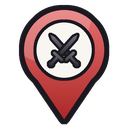 | `rally_point` | Rally point: map pin with crossed swords |
|  | `scout` | Scout: watchful eye |
| 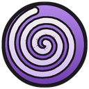 | `teleport` | Teleport: purple vortex |
| 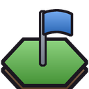 | `territory` | Territory: hex tile with a planted flag |
|  | `territory_lost` | Territory lost: scorched tile, broken flag |
| 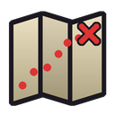 | `planner` | Territory planner: folded map with a route |
|  | `vs_win` | VS duel win banner |
| 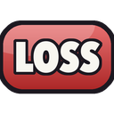 | `vs_loss` | VS duel loss banner |
| 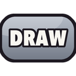 | `vs_draw` | VS duel draw banner |
|  | `vs_day1` | VS duel day 1 calendar tile |
| 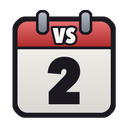 | `vs_day2` | VS duel day 2 calendar tile |
| 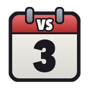 | `vs_day3` | VS duel day 3 calendar tile |
| 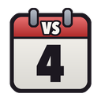 | `vs_day4` | VS duel day 4 calendar tile |
|  | `vs_day5` | VS duel day 5 calendar tile |
|  | `vs_day6` | VS duel day 6 calendar tile |

## Zombies and survival (27)

| Emoji | Name | What it is |
|---|---|---|
| 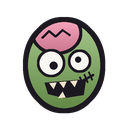 | `zombie` | Zombie head |
| 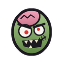 | `zombie_angry` | Angry red-eyed zombie |
| 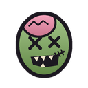 | `zombie_dead` | Downed zombie with X eyes |
| 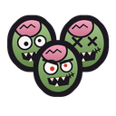 | `zombie_horde` | A horde of zombies |
| 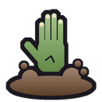 | `zombie_hand` | Zombie hand bursting from the ground |
| 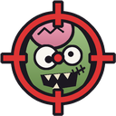 | `headshot` | Headshot: zombie in the crosshairs |
| 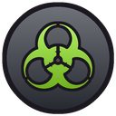 | `infected` | Infection: toxic biohazard mark |
| 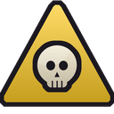 | `hazard_zone` | Danger zone sign with a skull |
|  | `blood_moon` | Blood moon night event |
| 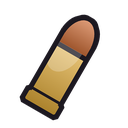 | `bullet` | Rifle round |
| 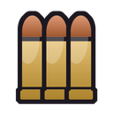 | `ammo` | Ammo: three rounds |
| 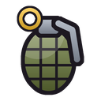 | `grenade` | Frag grenade |
| 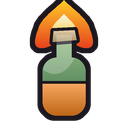 | `molotov` | Molotov cocktail |
| 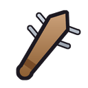 | `nail_bat` | Baseball bat studded with nails |
| 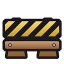 | `barricade` | Hazard-striped barricade |
| 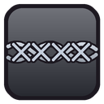 | `barbed_wire` | Barbed wire |
| 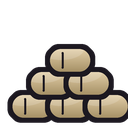 | `sandbags` | Sandbag wall |
| 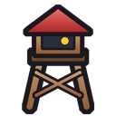 | `watchtower` | Watchtower lookout |
| 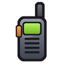 | `walkie_talkie` | Walkie-talkie |
| 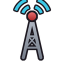 | `radio_tower` | Radio tower broadcasting |
| 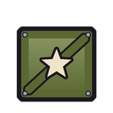 | `supply_crate` | Military supply crate |
| 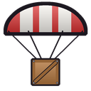 | `airdrop` | Supply airdrop under a parachute |
| 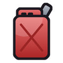 | `fuel_can` | Jerry can of fuel |
|  | `medkit` | Field medkit |
|  | `gas_mask` | Gas mask |
|  | `campfire` | Survivor campfire |
|  | `survivor_camp` | Survivor shelter behind a fence |

## Resources (4)

| Emoji | Name | What it is |
|---|---|---|
|  | `res_food` | Food resource token |
|  | `res_wood` | Wood resource token |
|  | `res_steel` | Steel resource token |
|  | `res_oil` | Oil resource token |

## Trivia (18)

| Emoji | Name | What it is |
|---|---|---|
|  | `trivia` | Trivia question bubble |
|  | `answer_a` | Answer button A |
|  | `answer_b` | Answer button B |
|  | `answer_c` | Answer button C |
|  | `answer_d` | Answer button D |
|  | `answer_correct` | Correct answer |
|  | `answer_wrong` | Wrong answer |
|  | `count_3` | Countdown 3 |
|  | `count_2` | Countdown 2 |
|  | `count_1` | Countdown 1 |
|  | `count_go` | Countdown GO |
|  | `streak_3` | 3-answer streak flame |
|  | `streak_5` | 5-answer streak flame |
|  | `streak_10` | 10-answer streak flame |
|  | `pts_1` | +1 points coin |
|  | `pts_5` | +5 points coin |
|  | `pts_10` | +10 points coin |
|  | `trivia_champ` | Trivia champion trophy |

## Reports and bot (13)

| Emoji | Name | What it is |
|---|---|---|
|  | `lz_assistant` | LastZ Assistant logo mark |
|  | `lz_bot` | The bot's zombie-robot mascot |
|  | `report` | Weekly report document |
|  | `csv_file` | CSV export file |
|  | `ocr_scan` | OCR screenshot scan |
|  | `ingest` | Ingest data into the database |
|  | `database` | Alliance database |
|  | `backup` | Database backup |
|  | `export` | Export a file |
|  | `gift_code` | Gift code ticket |
|  | `gift_claimed` | Gift code redeemed |
|  | `gift_reminder` | Gift code reminder |
|  | `screenshot` | Game screenshot |

## Plans (3)

| Emoji | Name | What it is |
|---|---|---|
|  | `tier_free` | Free plan badge |
|  | `tier_alliance` | Alliance plan badge |
|  | `tier_command` | Command plan badge |

## Text tags (18)

| Emoji | Name | What it is |
|---|---|---|
|  | `tag_new` | NEW tag |
|  | `tag_beta` | BETA tag |
|  | `tag_live` | LIVE tag |
|  | `tag_mvp` | MVP tag |
|  | `tag_gg` | GG tag |
|  | `tag_afk` | AFK tag |
|  | `tag_lfg` | LFG tag |
|  | `tag_buff` | BUFF tag |
|  | `tag_nerf` | NERF tag |
|  | `tag_soon` | SOON tag |
|  | `tag_op` | OP tag |
|  | `tag_rip` | RIP tag |
|  | `tag_ty` | TY tag |
|  | `tag_gl` | GL tag |
|  | `tag_wip` | WIP tag |
|  | `tag_ok` | OK tag |
|  | `tag_warn` | WARN tag |
|  | `tag_err` | ERR tag |
